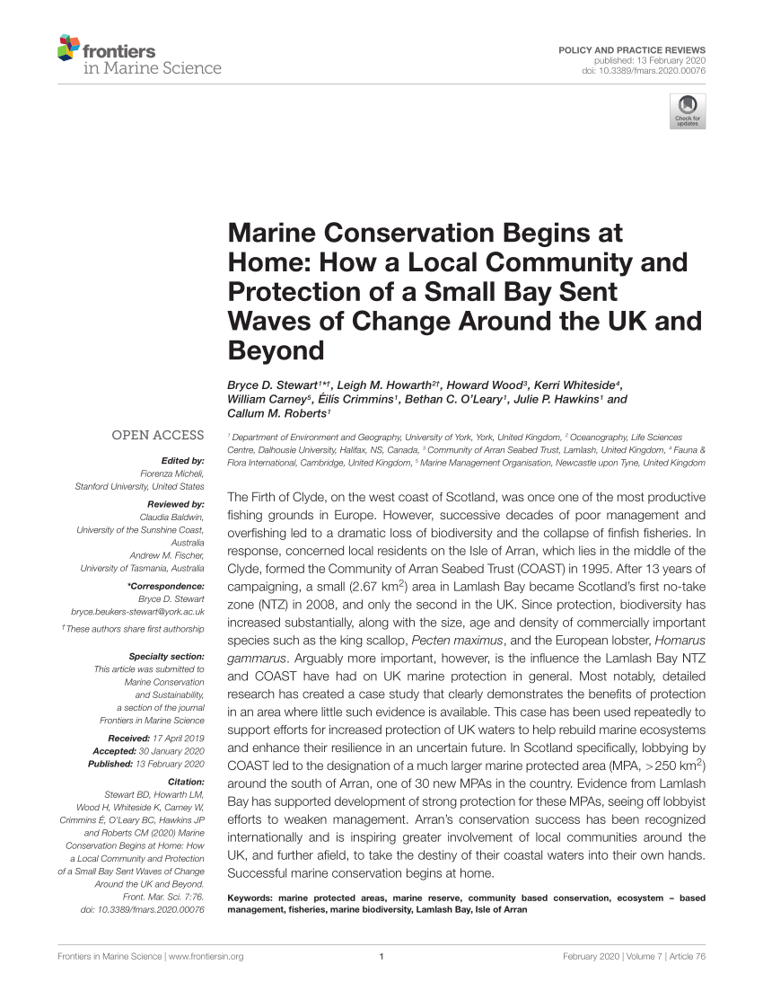
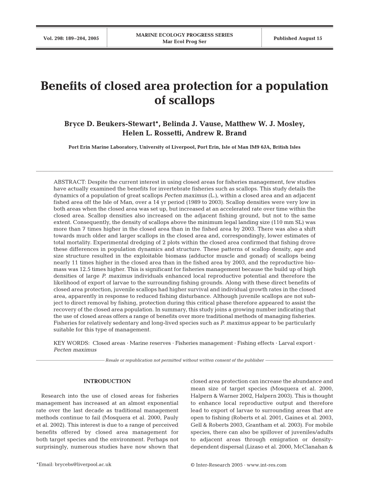
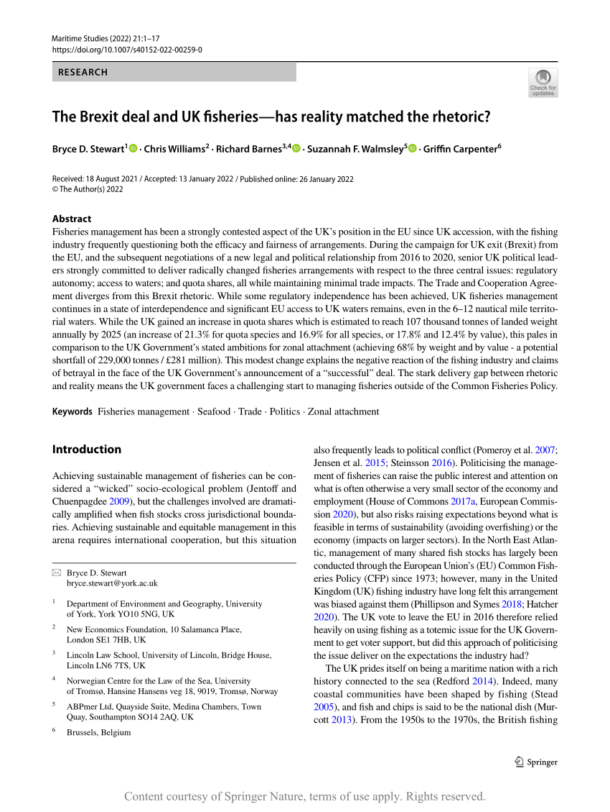
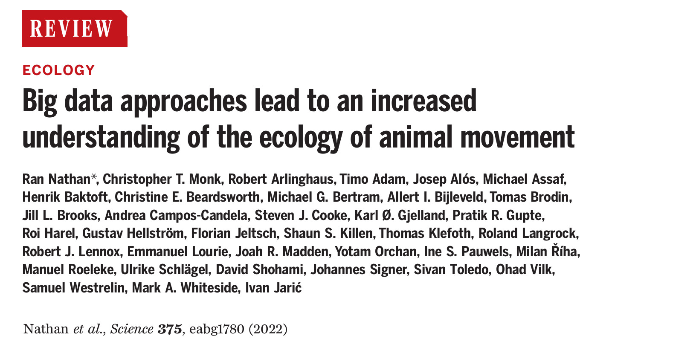
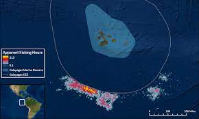

# Motivation

::: {.rmdimportant}

A COVID Classroom

:::

::: {.rmdimportant}

A Learning Management System Nightmare

:::

;:: {.rmdimportant}

Concise, Precisely Organized, Frequently Revised Assignments and Schedules

:::

:::

;:: {.rmdimportant}

Concise, Precisely Organized, Frequently Revised Assignments and Schedules

:::

;:: {.rmdimportant}

Concise, Precisely Organized, Frequently Revised Assignments and Schedules

:::

;:: {.rmdimportant}

Concise, Precisely Organized, Frequently Revised Assignments and Schedules

:::

;:: {.rmdimportant}

Concise, Precisely Organized, Frequently Revised Assignments and Schedules

:::

# Real life example

::: {.rmdimportant}

It's nice to know exactly what you did when your original data requires wrangling.

:::
