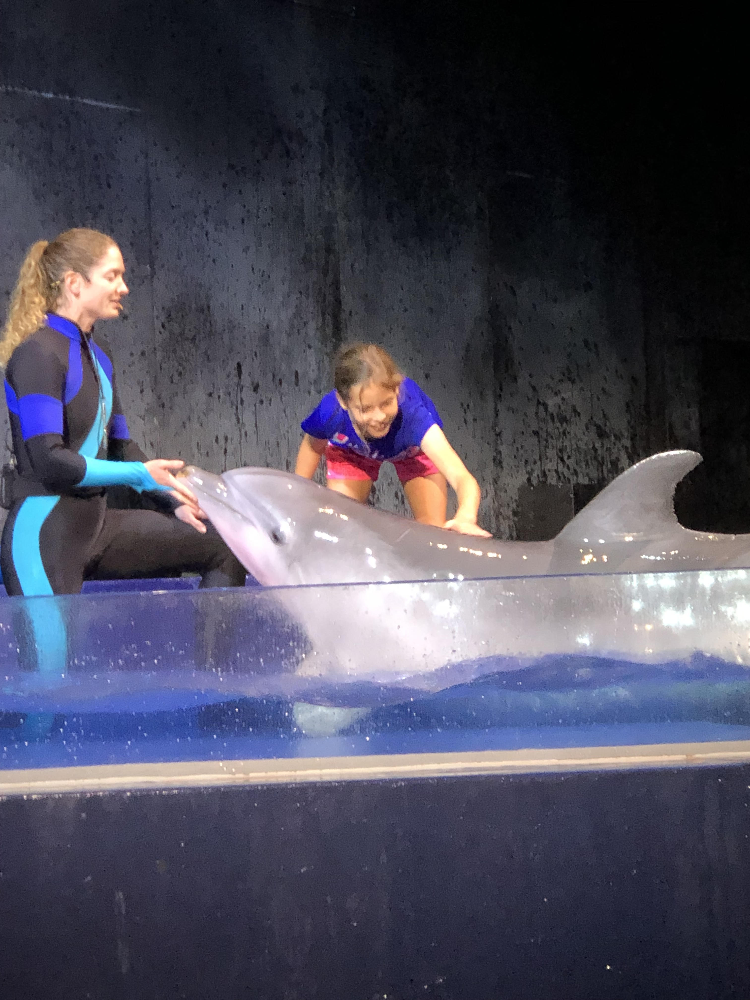

# Motivation

::: {.rmdimportant}

A COVID Classroom

:::

::: {.rmdimportant}

A Learning Management System Nightmare

:::

;:: {.rmdimportant}

Concise, Precisely Organized, Frequently Revised Assignments and Schedules

:::

Date | Topic | 				
|:-------|:------			
| 	Wednesday, February 16, 2022	| 	SEDSI in Jacksonville	| 
| 	Thursday, February 17, 2022	| 	Present at 2:45 PM	| 
| 	Friday, February 18, 2022	| 	Celebrate a successful DASI Session	| 

# Real life example

::: {.rmdimportant}

It's nice to know exactly what you did when your original data requires wrangling.

:::
